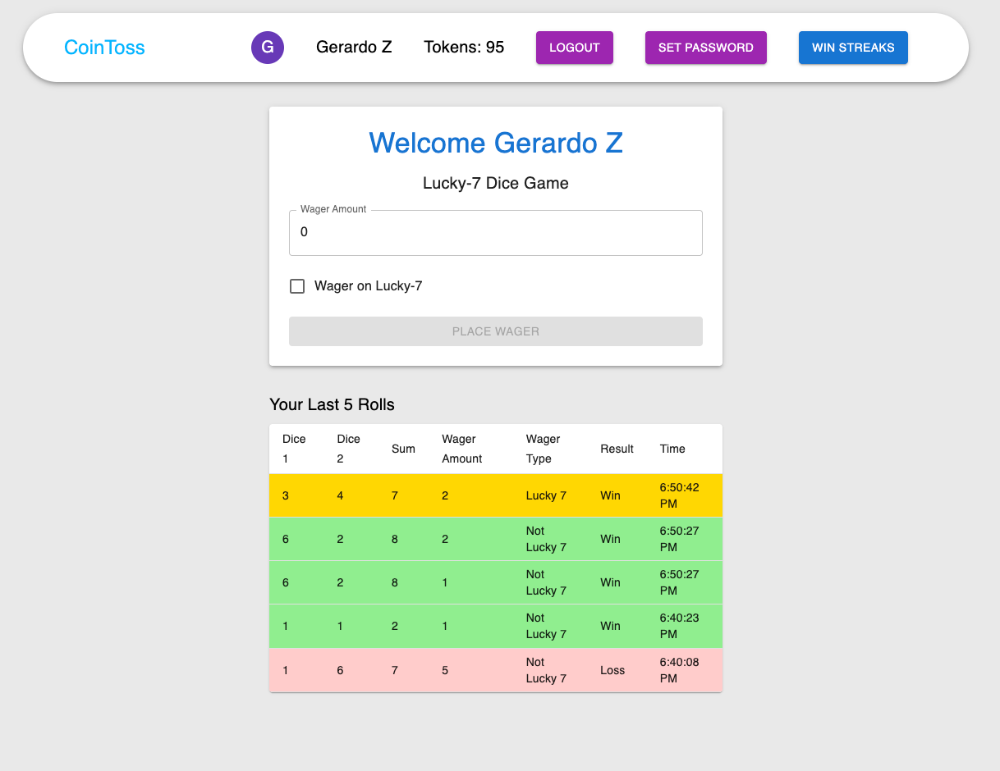
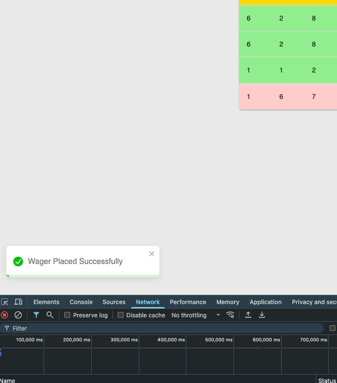
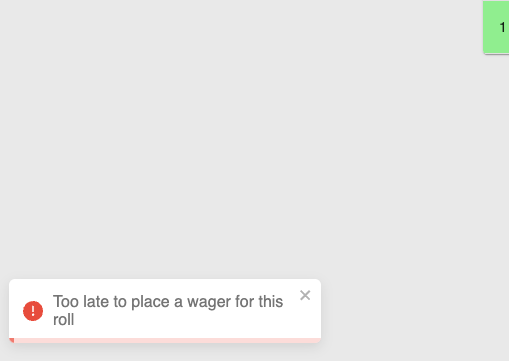
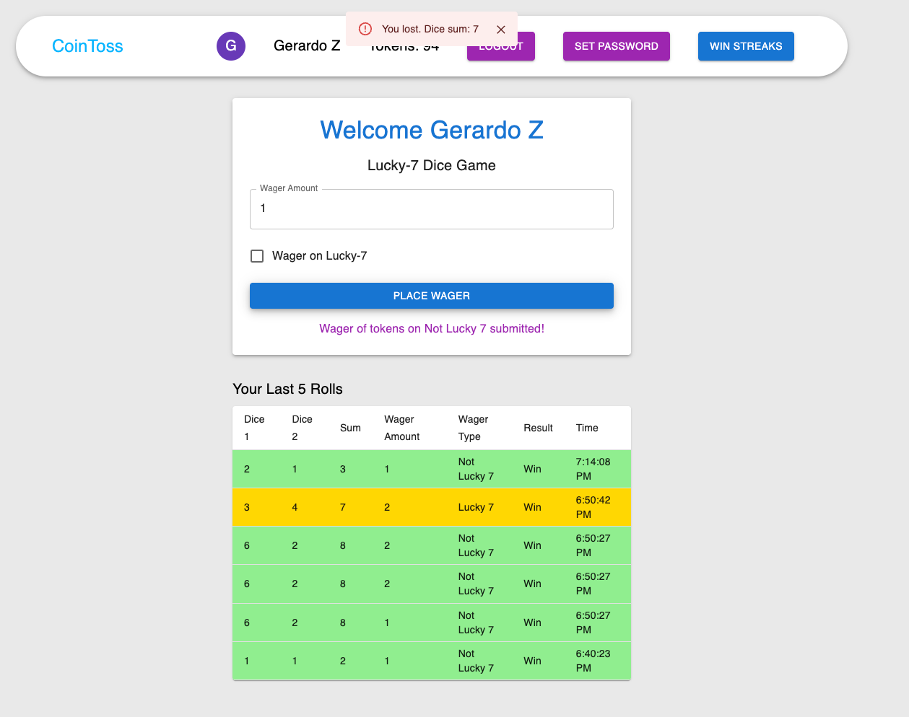
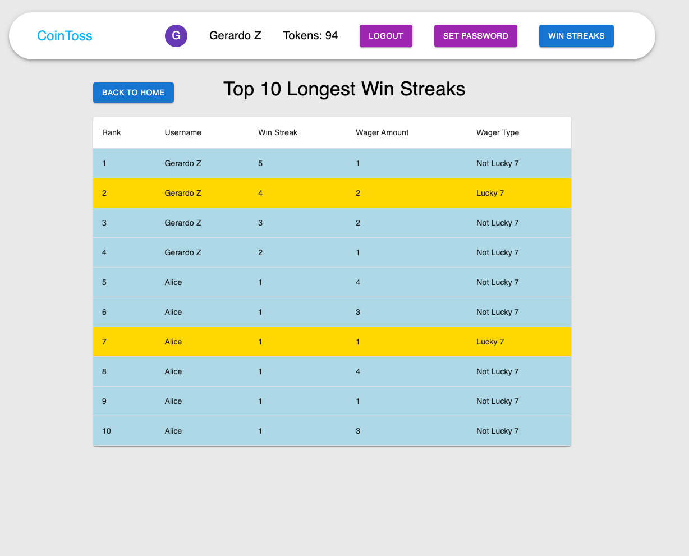

# Pidwin Frontend

This is the frontend application for the Pidwin Fullstack Assessment.

## Overview

The frontend is built with:
- React
- TypeScript
- Material-UI for components
- Redux for state management
- Socket.io client for real-time updates

## Setup

### Prerequisites

- Node.js (v16 or later recommended)
- npm or yarn

### Installation

Install dependencies:

```bash
npm install
```

## Available Commands

```bash
# Start the development server
npm start

# Build for production
npm run build

# Run tests
npm test
```

## Features

The frontend application includes:

- User authentication (login/signup)
- Password change functionality
- Lucky-7 dice game with real-time token updates
- Responsive UI using Material-UI

## Connection to Backend

The frontend connects to the backend API at `http://localhost:5500` (when using Docker) or `http://localhost:5000` (when running locally).

WebSocket connections are also established to receive real-time updates for token balances.

## Project Structure

- `src/actions`: Redux action creators
- `src/components`: React components
- `src/constants`: Application constants
- `src/reducers`: Redux reducers
- `src/services`: Service classes including API and WebSocket services
- `src/types`: TypeScript type definitions

## Authentication

The application uses JWT (JSON Web Tokens) for authentication. When a user logs in, the token is stored in localStorage and included in API requests.

## Development Notes

This project was bootstrapped with [Create React App](https://github.com/facebook/create-react-app).

For more information about Create React App, see the [Create React App documentation](https://facebook.github.io/create-react-app/docs/getting-started).


## Project Images

Home Page


Success 


Failed


Game Result


Win streaks
